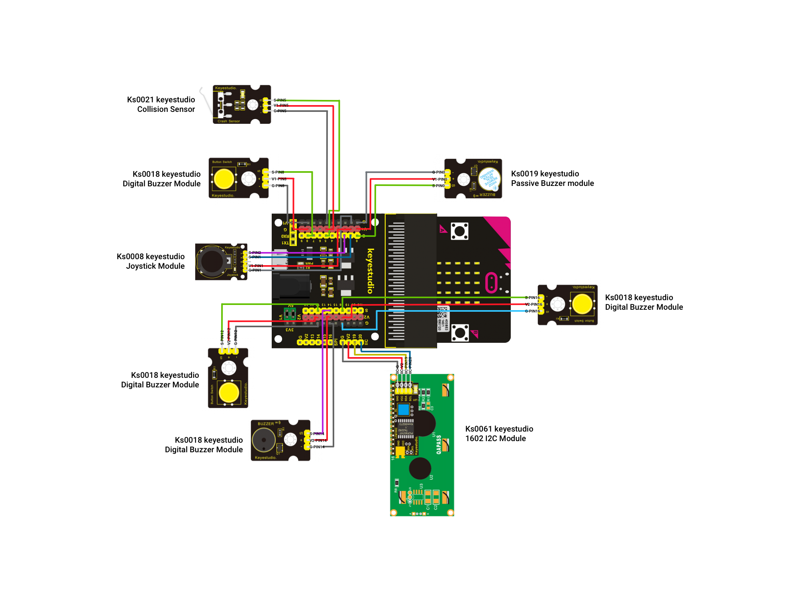

# microbitmusiccontroller
Music controller project for INFO697 at Pratt Institute, based on the BBC Microbit written in Python.  With this project you will be able to play and manipulate sounds with the Micro:bit controller and a variety of sensors.

## What do you need to get started
Below is a list of the following items you will need to create the music controller
* [KS0468 Keyestudio Micro:bit Main board](https://wiki.keyestudio.com/KS0468_Keyestudio_Storage_Bag_Micro:bit_Main_board_Kit) - 1x
* [Ks0360 Keyestudio Sensor Shield V2](https://wiki.keyestudio.com/Ks0360_Keyestudio_Sensor_Shield_V2_for_BBC_micro:bit) - 1x
* [Ks0008 keyestudio Joystick Module](https://wiki.keyestudio.com/Ks0008_keyestudio_Joystick_Module) - 1x
* [Ks0018 keyestudio Digital Buzzer Module](https://wiki.keyestudio.com/Ks0018_keyestudio_Digital_Buzzer_Module) - 1x
* [Ks0019 keyestudio Passive Buzzer module](https://wiki.keyestudio.com/Ks0019_keyestudio_Passive_Buzzer_module) - 1x
* [Ks0029 keyestudio Digital Push Button](https://wiki.keyestudio.com/Ks0029_keyestudio_Digital_Push_Button) - 3x
* [Ks0021 keyestudio Collision Sensor](https://wiki.keyestudio.com/Ks0021_keyestudio_Collision_Sensor) - 1x
* [Ks0061 keyestudio 1602 I2C Module](https://wiki.keyestudio.com/Ks0061_keyestudio_1602_I2C_Module) - 1x
* [KS0325 Keyestudio Dupont Jumper Wire 20CM Package](https://wiki.keyestudio.com/index.php/KS0325_Keyestudio_Dupont_Jumper_Wire_20CM_Package_(M-M,_M-F,_F-F))

## Configuration of Components

Below is a configuration diagram off all the Microbit parts needed for this project. 

**PLEASE CLICK THE IMAGE BELOW TO ZOOM IN AND DOWNLOAD THE FULL IMAGE**

## Uploading of Microbit with python code
Once you have the microbit configured correctly, use plug the *Micro USB cable* into the *KS0468 Keyestudio Micro:bit Main board* and then into your computer.  Using a compatible Micro:bit python editor, like Mu-Editor or [Microbit Python Editor](https://python.microbit.org/v/2.0), upload [python code](https://github.com/armbur/microbitmusiccontroller/blob/master/music_controller.py) to the microbit.

 ## General Instructions on how to use the Music Controller

The play controller has two modes:
1. Free Play mode
2. Pitch Modulator mode

By default Free Play is enabled when you power on the Microbit and you can press any of the Digital Push Buttons to play a musical note. In the python code the notes are hard coded to each digital push button as follows:
* Pin8 = 'G3:4', 'D5:4'
* Pin12 = 'G3:4', 'D5:4'
* Pin16 = 'G4:4','A4:4'

To engage Pitch Modulator mode, you need to first press the Collision Sensor (Pin5).  In this mode, a note at a frequency of 1500hz and 100 milliseconds is played repeatedly. You can can interact with the pitch by doing the following: 
* Frequency - Pushing up or down on the joystick increase or decrease the frequency in intervals of +/- 100.  
* Speed - When this mode is active, 2 of the digital push buttons are repurposed to control the pitch speeds in +/- 10 milliseconds.  The digital push button in pin16 increases the speed and the digital push button in pin8 decreases the pitch speed. 

You can turn off Pitch Modulator mode and return to Free Play mode by pressing the Digital Push Button in pin12.

## Acknowledgements
* [LCD Code](https://github.com/Pratt-Institute/MicroPython4MicroBit/blob/master/lcd_complete.py) by Pratt Institute SI
